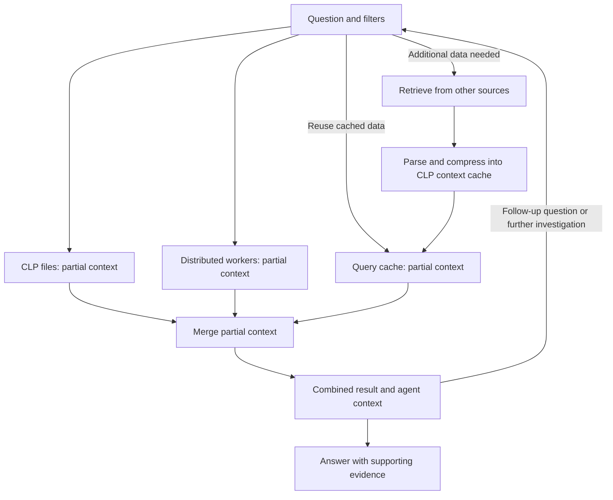

# Agentic Semantic Analysis — Capabilities

**Fast, efficient discovery, search, and analysis across logs, traces, and metrics**

CLP combines lossless storage with efficient queries and tools for analysis. It natively supports wide events across logs, traces, and metrics, discovering their fields, nesting, data types, and message patterns within strings during ingestion. The resulting representation supports **key-value, wildcard, and semantic search queries** without requiring users to design or maintain a schema.

Agentic Semantic Analysis builds on this foundation. **The discovered structure and patterns are directly accessible for analysis and remain linked to the underlying compressed records.** The agent uses this information from the filtered data to build context, compare behavior, correlate findings, and test explanations. That context supports investigation of massive datasets while preserving access to the records behind each finding.

The [demo walkthrough](agentic-semantic-analysis-demo.md) shows how to exercise these capabilities; the [tooling companion](agentic-semantic-analysis-tooling.md) describes the interfaces.

## CLP stores structure, patterns, and data as context

Wide events can have many fields and nested attributes, with different structures from record to record. CLP discovers these as data arrives, allowing users to mix and match logs, traces, and metrics and query them together.

CLP captures **fields, nesting, and data types** in a merged schema tree. It separates **message patterns within strings** from their variable values, storing the recurring text in a template dictionary. It also captures **numeric value ranges and statistics** for filtering and analysis. These are intrinsic parts of the stored representation. Storage is lossless: CLP retains the structure, patterns, and original values needed to reconstruct the ingested records.

This is the basis for **semantic storage**. Queries and analysis use the stored structure and numeric metadata, while semantic search matches record structure and message patterns by meaning. Results remain linked to the underlying compressed records.

Message patterns give the agent a vocabulary of recorded events—capacity waits, retries, resource allocation—and help it identify what to investigate. The discovered structure exposes fields present in the selected data, showing how to narrow the investigation. For example, `resource.host.name`, `trace.id`, or `duration_ms`, when present, let the agent filter by host, follow a trace, or examine duration. Numeric ranges and statistics help guide those choices.

The same CLP format **can be used in distributed storage or as a local cache of retrieved data**. The stored data remains queryable; the results and metadata returned for a particular question become the agent's working context.

## Query the data relevant to the question

A question and its filters define the actual data scope: a service, time window, host, request, or other condition. **Discovery, retrieval, and analysis describe the selected records.** That selection can range from one request to months of activity across many services.

Within this scope, the agent uses CLP's stored representation and queries to establish which fields and patterns are present, examine numeric ranges and statistics, and count events. As filters change, the context changes with the selected data.

| Query capability | What it lets the agent express |
|---|---|
| Key-value and range queries | Select a service, host, request or trace identifier, severity, metric value, or duration condition. |
| Wildcard queries | Match a known prefix, suffix, or fragment in supported fields or message shapes. |
| Semantic search queries | Find relevant structure and events by meaning, such as messages about requests waiting for capacity. |

These modes work together. To investigate “Why did requests slow down on these hosts during this interval?”, the agent can inspect latency metrics, locate slow traces, and search related logs for capacity waits. Discovered fields provide the dimensions for narrowing results and correlating evidence according to the question's intent.

## Assemble and reuse context across files, workers, and data sources

A query can draw on CLP files, distributed workers, and results retrieved from other sources. Each contributes partial context—structure, patterns, statistics, or supporting records—which is merged into a result for the selected data. The merge retains source provenance and accounts for overlapping results.

Data already in CLP format can be queried directly. Results from another source can be parsed and compressed locally, discovering their structure and patterns along the way. **The locally stored CLP representation is itself the context cache** and becomes the direct input for subsequent queries, question answering, and analysis.

Only the sources needed for the question participate. Follow-up queries reuse the cache for quick lookup; questions that require additional or fresher data trigger another source query. Retaining the source filters and retrieval time makes the cache's coverage clear.

## Use the context to investigate and answer

With the fields and event vocabulary in hand, the agent can classify related templates, organize them into categories relevant to the question, and choose queries grounded in the selected data. Clustering reduces repeated classification by grouping similar templates while retaining every member for inspection.

The agent can then:

- **Compare behavior:** count events, compare incident and reference selections, and identify changed frequencies or missing expected events.
- **Correlate and localize:** connect logs, traces, and metrics through available identifiers and time fields, then narrow findings to a host, component, or request.
- **Test explanations:** retrieve supporting records, consult source code or other evidence when available, and choose the next query from what the previous one returned.
- **Answer or continue:** answer when the context contains sufficient evidence; otherwise query the store or cache and refine the scope.

Findings retain their filters, executed queries, and supporting records. Categories remain model interpretations that can be inspected; a missing event needs an explicit expectation or reference selection, and an observed change needs further evidence to establish its cause.

Applicable classifications can be reused across investigations. The query plan is adapted to the current data and question, so each pass through the loop builds on what is already known.

## Why this is fast and scalable

CLP discovers structure and message patterns at **more than 250 MB/s per core**, with **end-to-end ingestion including compression exceeding 100 MB/s per core**. Subsequent discovery reads the stored metadata, and queries operate over the compressed representation without first reconstructing the full archive. Distributed workers process their portions of the data, while local caches avoid repeatedly retrieving and parsing the same external results.

### Why semantic search can scale with CLP

Embedding every record creates a vector population that grows with event volume. A vector index can accelerate lookup, but the embeddings still need to be generated, stored, and maintained. At petabyte scale, that work can dominate the cost of enabling semantic search.

**CLP applies semantic matching to discovered record structure and distinct message templates shared by many records.** Both are already part of the storage format and linked to the records they describe. Queries operate over these shared representations, reuse cached embeddings, and can score locally to reduce remote calls. Matches then guide record retrieval under the query's filters.

For message patterns, **N records sharing T templates need T template embeddings rather than N record embeddings**. One billion records sharing 100,000 templates would mean 10,000 times fewer embedding items for that part of the data. This illustrates the reduction in embedding count; it is not a measured latency improvement.

The advantage grows when event volume increases faster than structural and template diversity. New patterns and cache misses add semantic work, while filtering and retrieving records still incur costs. Queries about variable values use the retained data. Overall latency depends on these costs, archive layout, hardware, and concurrency.

## Where these capabilities apply

**Operational investigation.** Follow a metric change through affected traces to related logs, compare behavior with a reference selection, and localize the change. The inventory can reveal event types the initial search missed.

**Agent session analysis.** Inspect actions, arguments, results, and timing to identify repeated behavior and failures. Examine repeated calls and their outcomes to determine where the agent stopped making progress.

**Security and behavior review.** Inventory observed authentication, authorization, access, and lifecycle events. Compare them with explicit expectations to investigate changes and missing events within the selected data.

## Current scope and validation

The available tools support discovery, querying, and local context caching through agent workflows. The distributed execution and merging described here should be demonstrated in the target deployment. The [tooling companion](agentic-semantic-analysis-tooling.md) documents the available interfaces and configuration.

Input coverage, parsing, retrieval settings, and classification quality determine what the analysis can establish. Skipped records, truncated source results, and missed semantic matches narrow that coverage. Embedding and agent-model configuration determines where data is processed.

For an Uber pilot, choose one service and operational question and compare with the team's current investigation method. Measure retrieval quality, time to a supported answer, resource use, and the savings from reuse. The [demo evaluation](agentic-semantic-analysis-demo.md#7-results-to-attach) specifies the evidence to collect. Petabyte-scale latency and cost remain to be validated with representative data, structural and template diversity, and concurrency.

A reproducible result gives Yun a concrete basis for selecting a broader prototype and presenting its value.
