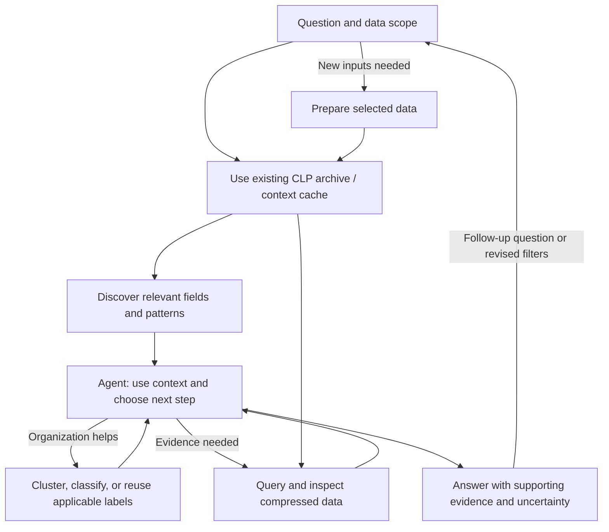

# Agentic Semantic Analysis — Tooling Companion

**Choose tools for a question, understand their outputs, and compose an investigation**

The [capabilities overview](agentic-semantic-analysis-capabilities.md) explains what CLP enables and why it is efficient. This document maps those capabilities to the tools available in this repository: what each accepts, what it returns, and when to use it. The [demo walkthrough](agentic-semantic-analysis-demo.md) provides a concrete run procedure and the evidence to capture.

The tools fall into five categories: **prepare data, discover context, query and inspect, organize and reuse context, and investigate and answer**. These are building blocks, not mandatory sequential stages. Start with an existing archive or cached context when available; ingest only new inputs, and use clustering or classification when the question benefits from them.

Most of the tooling is general-purpose. Adapting it to a new source typically requires a small amount of integration: locating and accessing the data, ensuring the source emits the records needed for the investigation, and teaching the agent how to discover and select the relevant files, sessions, or datasets. CLP discovers the data's structure and message patterns; the same query, clustering, caching, and investigation tools can then be reused.

The wrappers below operate on local CLP archives. Distributed worker orchestration and cross-source context merging are outside this local interface. Tool paths are relative to `plugins/clp/bin/`; see the [plugin README](plugins/clp/README.md) for setup.

## 1. Prepare data

Create a queryable CLP archive from the data selected for investigation. For results retrieved from another system, the archive itself becomes the local context cache for subsequent queries.

| Tool | What it does | Input | Output | When to use |
|---|---|---|---|---|
| `clp-s-list-sessions` — wrapper | Lists available Claude Code or Codex sessions. | Session root and selection options. | TSV manifest. | Find the session to investigate. |
| `clp-s-compress-session` — wrapper | Compresses a selected session. | Session JSONL, directly or through a manifest selection. | Archive directory and compression stats. | Prepare a session for trajectory analysis. |
| `clp-s-compress-folder` — wrapper | Compresses files in a folder. | Supported structured logs, or supported text with `--structurize`. | Archive directory and compression stats. | Prepare service logs or externally retrieved records. |
| `structurize.py` — helper | Converts supported text formats to structured records. | Text logs. | JSONL. | Preprocess text through the folder wrapper's `--structurize` option. |

Preserve the source, filters, and retrieval time alongside externally retrieved data. The cache covers that selection, not the entire source. Inspect preprocessing warnings and skipped files; the archive cannot recover records omitted before compression.

## 2. Discover context

Read CLP's intrinsic metadata to learn what can be queried: fields and nesting, data types, and message patterns. Use record queries to establish which of these occur in the investigation's actual scope.

| Tool / operation | What it does | Input | Output | When to use |
|---|---|---|---|---|
| `clp-s-search-kql` with `stats.schema_tree` | Reads stored record structure. | Archive. | Schema metadata. | Discover field paths and nesting before choosing filters. |
| `clp-s-search-kql` with `stats.log_shapes` | Reads stored message patterns. | Archive. | Raw shape dictionary with identifiers and available counts. | Discover the event vocabulary and retain links to stored patterns. |
| `logtype-insights-bootstrap` — helper | Samples records, normalizes the dictionary, and checks for reusable classifications. | Archive and optional sampling/cache settings. | Summary, sampled field distributions, template files, and classification-cache status. | Prepare an initial working context for an unfamiliar archive. |

**Match discovery to the data scope.** These stats commands and bootstrap describe their input archive; they do not accept an arbitrary KQL predicate for filtered discovery. If the archive contains exactly the selected data, the scopes match. Otherwise, treat its metadata as candidates and execute scoped queries to establish which fields and patterns occur. A later record filter does not retroactively scope an archive-wide dictionary.

### Interpreting discovery output

- `stats.log_shapes` requires a binary with the shapes API; the wrapper enables the experimental flag so clpp archives open too. Each entry's `count` is how many values in that archive carried the template, stored at compression time. It is `null` for archives compressed before clp-s stored these counts: that is not zero or a measured frequency.
- `logtype-cache normalize` renders variable placeholders as `<*>` and deduplicates displayed templates. Retain the raw dictionary when identifiers and original encodings matter. Downstream, `logtype-cluster` caps each template at a character limit (512 by default) and de-duplicates the capped forms for embedding, and `logtype-cache` fingerprints that same capped, de-duplicated set — while the templates it stores stay full.
- Bootstrap's `SAMPLE` and `DIST` come from sampled records, capped at 20,000 by default. They are discovery aids, not full-archive counts or stored numeric range/statistics metadata.
- Bootstrap reports `FREQS=OK` with a `FREQS_FILE=` when every archive stored its counts; that file holds complete per-template frequencies. `FREQS=UNAVAILABLE` means at least one archive predates the stored counts, and no frequencies are reported for it.

The capabilities overview also discusses stored numeric ranges and statistics. The local interfaces documented here do not establish a dedicated retrieval command for that metadata; numeric range predicates in record queries are a separate operation.

## 3. Query and inspect

Use discovered fields and patterns to retrieve evidence from the compressed data. The same search wrapper serves both metadata discovery and record queries.

| Tool | What it does | Input | Output | When to use |
|---|---|---|---|---|
| `clp-s-search-kql` — wrapper | Executes key-value, wildcard, and semantic search queries, including combined predicates. | Archive, KQL query, and optional time bounds/projection. | Matching results on stdout, plus wrapper metadata headers. | Narrow the investigation, test a hypothesis, or retrieve supporting records. |
| `logtype-query-plan-run` — helper | Executes a classification's query plan through `clp-s-search-kql`, entry by entry, rendering each entry's structured `match` filter to KQL with `kql-build`, and reports each result as it completes. | Archive and the extracted query plan. | Per-entry KQL, count, share of records, status (ok, zero, error, timeout, non-selective), elapsed time, and samples, as NDJSON and a Markdown table. | Run a stored plan with visible progress and see which of its queries fail or do not discriminate. |
| `clp-s-decompress` — wrapper | Reconstructs stored records. | Archive. | Decompressed records. | Export or inspect raw data when query results are insufficient. |

Filter wrapper metadata headers before parsing search output as NDJSON. Counting returned JSON lines is local processing, not archive-side aggregation; a record can also contain multiple events or tool calls.

### Query modes

These examples assume the named fields exist and support the operation:

| Mode | Example |
|---|---|
| Key-value | `level:ERROR` |
| Numeric range | `durationMs >= 30000` |
| Wildcard | `logger:"worker*"` for a prefix; `logger:"*worker*"` for a substring. Quote every wildcard value. |
| Semantic search | `semantic("requests waiting for available capacity")` |
| Combined | `level:ERROR AND logger:worker* AND semantic("requests waiting for available capacity")` |

Time bounds use `--tge` and `--tle` in epoch milliseconds. Validate paths against the discovered schema. Literal and wildcard behavior depends on storage type and binary support; a message-field predicate is not interchangeable with a query over its stored shape. The experimental path supports shape wildcards such as `shape(message): "*error*"` with `--experimental` on a compatible binary/archive.

See the [shared search reference](plugins/clp/skills-claude/references/shared-search.md) and [experimental query reference](plugins/clp/skills-claude/references/clpp-shared.md) for syntax.

### Semantic-search controls and measurement

The documented wrapper path matches message-template embeddings and retrieves records satisfying the selected templates and structured predicates. Controls include `--semantic-endpoint`, `--semantic-top-k`, and `--semantic-threshold`. The broader capability includes semantic matching over record structure; a corresponding invocation is not established by this wrapper's documented logtype-search interface.

Pin the endpoint for reproducible runs: without an explicit endpoint, the wrapper can try local and remote endpoints.

Measure preparation and matching separately from archive search and result output. Record candidate scope, uncached templates, cache state, and returned records where instrumentation permits. A narrow record filter does not prove that embedding or scoring considered only templates in that selection. The [capabilities overview](agentic-semantic-analysis-capabilities.md#why-semantic-search-can-scale-with-clp) explains the scaling rationale; the wrappers alone do not establish a petabyte-scale performance result.

## 4. Organize and reuse context

Group patterns when that helps the question, and reuse applicable work as the investigation develops. These helpers organize context; they do not execute record queries or independently determine what happened.

| Tool / operation | What it does | Input | Output | When to use |
|---|---|---|---|---|
| `logtype-cluster cluster` — helper | Groups similar templates using embeddings from the configured semantic server, after capping each at a character limit (512 by default) and de-duplicating. | Normalized templates and server/threshold settings. | Representatives and retained cluster memberships (full templates). | Reduce the number of patterns the agent needs to classify individually. |
| `logtype-cluster expand` — helper | Propagates assigned cluster labels to members. | Clusters and agent-produced classifications. | Template-level classifications. | Apply and review representative labels across the inventory. |
| `logtype-cache` — helper | Normalizes templates, fingerprints truncated and de-duplicated template sets, and retrieves, stores, or merges classifications. | Shape dictionaries, template sets, or classification JSON, depending on the subcommand. | Normalized templates, cache status/diffs, or cached categories and query plans. | Reuse applicable labels and identify additions needing classification. |

**The agent assigns categories; the helpers cluster, expand, and cache them.** The typical path is cluster → agent labels representatives → expand → review → store or merge. Membership is retained, but a representative's category can be wrong for an individual member. Keep questionable or unclassified templates visible. Clustering uses the same embedding server as semantic search — there is no separate local model or setup step.

### Three distinct forms of reuse

| Stored representation | What it retains | What it enables |
|---|---|---|
| **CLP context cache** | Retrieved records, their structure, and message patterns in CLP format. | Further direct queries, question answering, and evidence retrieval without fetching the same data again. |
| **Classification cache** | Categories and query plans keyed by a truncated, de-duplicated template fingerprint. | Reuse of applicable labels and incremental classification. |
| **Semantic cache** | Embeddings used by semantic search. | Reduced repeated embedding work. |

Classification-cache states are `NEW` (no compatible entry), `UPTODATE` (matching template set), and `GROWTH` (a cached subset plus additions). For growth, classify additions and merge rather than repeating all classification.

A template fingerprint does not encode application identity, schema, question, or all filters. It is computed over templates capped at a character limit and de-duplicated, so a change confined to a template's tail beyond that limit does not register as growth — treat the cache as a reuse aid, not a change detector. Check cached field mappings, categories, and query plans against the current data and question. Disappearing templates and changed capture composition require explicit comparison; the classification cache is not an anomaly baseline.

## 5. Investigate and answer

Skills guide the agent's use of the tools around a question. They are orchestration instructions, not additional storage or query engines.

Source-specific skills add guidance about how records are emitted and what their fields mean—for example, how a session represents tool calls and outcomes. They apply the shared tools to that format rather than requiring a separate analysis implementation for each source.

| Skill | What it does | Input | Output | When to use |
|---|---|---|---|---|
| `logtype-insights` | Guides discovery, classification, query planning, and evidence gathering. | Question, archive, and explicit investigation filters. | Findings with executed queries, supporting records, and uncertainty. | Investigate unfamiliar service data or an operational symptom. |
| `claude-code-trajectory` | Analyzes activity using the Claude Code session schema. | Selected session and question. | Session analysis grounded in tool calls, outcomes, and timing. | Investigate repetition, failures, long turns, or compaction in Claude Code. |
| `codex-trajectory` | Analyzes activity using the Codex session schema. | Selected session and question. | Session analysis grounded in that format's records. | Investigate Codex behavior without assuming Claude field names. |

Loaded context may answer questions about known fields or templates directly. Claims about an incident's timing, magnitude, or cause generally need executed queries and may require evidence beyond logs. Keep bulk output in local files; bring compact results and selected evidence into the agent's immediate context.

The investigation loops as the question or filters change:

## 6. Example tool compositions

### Investigate an operational symptom

Start with an archive and a declared service/time scope. Use `logtype-insights-bootstrap` and schema discovery to establish candidate context, then scoped `clp-s-search-kql` queries to check what occurs. Use semantic search to locate relevant events; optionally cluster and classify the inventory to examine other categories. Query occurrences and compare with an explicit reference window or expectation.

If semantic matches define the selected data, the inventory covers those matches. To evaluate coverage beyond semantic retrieval, use a separately declared broader scope. The [demo walkthrough](agentic-semantic-analysis-demo.md) details the evaluation procedure; it does not yet contain measured results.

### Turn external search results into reusable context

Preserve source filters and retrieval time → prepare supported JSONL or text → `clp-s-compress-folder` → discover context and run `clp-s-search-kql`. Reuse that CLP archive for follow-up questions. Fetch additional data only when the question exceeds its coverage or requires fresher records.

### Investigate a suspected agent loop

`clp-s-list-sessions` → `clp-s-compress-session` → the matching trajectory skill → targeted queries and inspection. For Claude Code data, `message.content.name:Bash` locates candidate records; inspect individual calls, arguments, outcomes, and timestamps to distinguish useful repetition from a loop.

Where present, `subtype:turn_duration AND durationMs >= 30000` finds long turns and `subtype:compact_boundary` finds compaction events. Treat `toolUseResult.success:false OR toolUseResult.stderr:*` as failure candidates, not proof: stderr does not necessarily mean failure. Frequency alone does not establish a loop.
